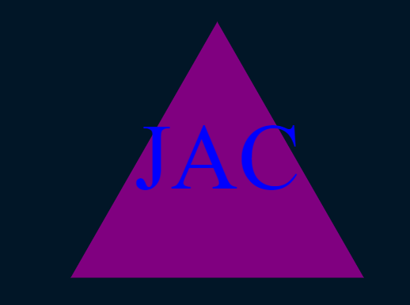

# LogoMaker
   
  ## Description

  creates SVG imagine based on user input

  ## VideoWalkthrough

[CLICK ME](https://drive.google.com/file/d/11unqdTmuYzt4bdS7Wwj-jGxPwa9Ls_pn/view?usp=sharing)

  ## Table of Contents
  * [Installation](#Installation)
  * [Usage](#Usage)

  ## Examples

  
  
  

  ## Installation
  To install the necessary dependencies, run the following command 
  >npm i 
  ## Usage
  install and run
  >node index.js
  ## License
  [https://opensource.org/licenses/MIT](https://opensource.org/licenses/MIT)

  ## Questions
  If you have any questions about the repo, open an issue or contact me directly at <micah.cox52@gmail.com>. you can find more of my work at [kalink52](https://github.com/kalink52)
